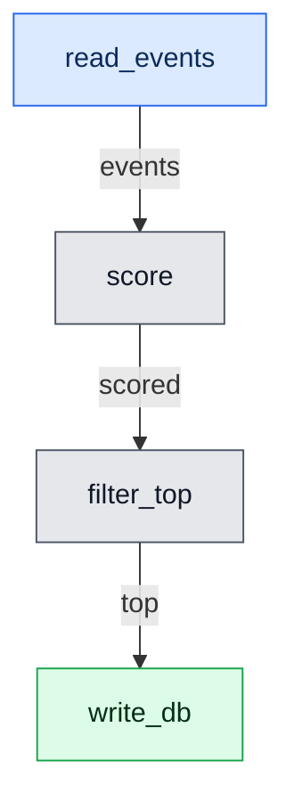

# Building pipelines

A pipeline is a set of steps plus the dependencies between them. You declare
steps on a [`PipelineBuilder`][masoora.PipelineBuilder], call
[`build()`][masoora.PipelineBuilder.build], and get a validated
[`Pipeline`][masoora.Pipeline].

```python
from masoora import PipelineBuilder, PipelineContext


class MyContext(PipelineContext):
    source_url: str
    min_score: float = 0.5


pipeline = (
    PipelineBuilder[MyContext]()
    .with_read_step(read_events, output="events")
    .with_transform_step(score, inputs=["events"], output="scored")
    .with_transform_step(filter_top, inputs=["scored"], output="top")
    .with_write_step(write_db, inputs=["top"])
    .build()
)
```

## The context

Every step receives the same context object as its first argument. It is a
Pydantic model, so it is validated once at construction and is typed
everywhere downstream.

```python
class MyContext(PipelineContext):
    source_url: str
    min_score: float = 0.5
```

Treat the context as **read-only**. Steps that mutate it break the parallel
execution contract — see [Parallel execution](parallel.md).

## The three step kinds

| Step kind | Signature | Effect |
|---|---|---|
| read | `fn(ctx) -> dataset` | `catalog[output] = result` |
| transform | `fn(ctx, *inputs) -> dataset` | `catalog[output] = result` |
| write | `fn(ctx, *inputs) -> None` | terminal |

The distinction is not cosmetic. Reads and writes are the pipeline's edges —
the places it touches the outside world — and those are exactly what the
testing helpers replace. Transforms are pure functions of their inputs and run
unchanged in tests.

## The catalog

Steps communicate through a [`DataCatalog`][masoora.DataCatalog]: an in-memory
key → dataset store. A step's `output` names the key it writes; a step's
`inputs` name the keys it reads.

masoora never inspects the values, so a dataset can be a polars DataFrame, a
pandas DataFrame, a Spark DataFrame, a list of dicts, or anything else.

```python
catalog = pipeline.run(MyContext(source_url="https://..."))
top = catalog["top"]
```

### Seeding the catalog

Keys that are populated before the run — passed in from a caller rather than
produced by a read step — are declared with `.with_seed(key)`:

```python
pipeline = (
    PipelineBuilder[MyContext]()
    .with_seed("events")
    .with_transform_step(score, inputs=["events"], output="scored")
    .build()
)
```

Without the declaration, `build()` rejects the pipeline: `events` would be an
input no step produces.

## Declaration order does not matter

`build()` topologically sorts the steps, so you can declare them in whatever
order reads best:

```python
pipeline = (
    PipelineBuilder[MyContext]()
    .with_write_step(write_db, inputs=["top"])  # declared first
    .with_read_step(read_events, output="events")  # runs first
    .with_transform_step(score, inputs=["events"], output="scored")
    .with_transform_step(filter_top, inputs=["scored"], output="top")
    .build()
)
```

## Seeing the pipeline

[`to_mermaid()`][masoora.Pipeline.to_mermaid] renders the pipeline as a Mermaid
flowchart:

```python
print(pipeline.to_mermaid())
```



Steps are nodes, coloured by kind. Catalog keys label the edges, except at the
boundaries: seeded inputs and outputs nothing consumes get their own nodes, so
you can see what the pipeline takes and what it leaves behind.


No dependencies are involved — the output is text. Paste it into a
```` ```mermaid ```` fence and GitHub, these docs, and Jupyter all render it.

Two arguments:

```python
pipeline.to_mermaid(direction="LR")       # TD, TB, BT, LR, RL
pipeline.to_mermaid(target="scored")      # only the steps feeding one key
```

Output is deterministic for a given pipeline, so a committed diagram only
changes when the pipeline does.

## Validation happens at build time

`build()` is where a malformed pipeline fails, not partway through a run:

- an input no step produces and no seed declares →
  [`PipelineValidationError`][masoora.PipelineValidationError]
- a dependency cycle → [`PipelineCycleError`][masoora.PipelineCycleError]

This matters because the alternative — discovering a missing key after the
read step has already pulled a million rows — is expensive.

At run time, a step that raises is wrapped in
[`StepExecutionError`][masoora.StepExecutionError] so you get the failing
step's identity alongside the original traceback.

Structure is checked at build time; the data itself is checked at run time, and
only for keys you have given a schema. See [Data validation](validation.md).

## Running part of a pipeline

Pass `target` to run only the steps needed to produce one key:

```python
catalog = pipeline.run(ctx, target="top")
```

Steps that `top` does not depend on are skipped entirely — including the write
step, which is often what you want while iterating.
